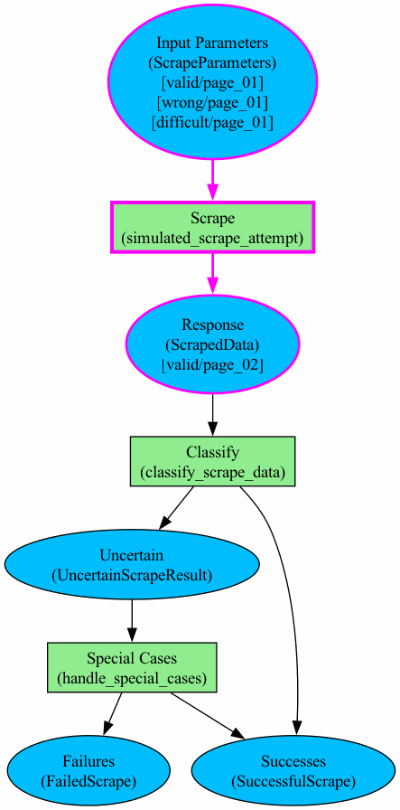

# Petritype

Petritype is an experimental, Petri net inspired, tool for prototyping and visualising data processing pipelines.

*This is an early concept sketch, feel free to get in touch if you find it interesting.*

# Overview

## What is a Petri Net
A Petri net (https://en.wikipedia.org/wiki/Petri_net) is a (bipartite) graph used to model a process.
They can be used to represent various processes in chemistry, logistics, ecology and many other fields.
A Petri net has two types of nodes, "places" and "transitions" connected by directed edges (a.k.a. arcs).
The state of the system (e.g. numbers of molecules, quantity and locations of objects)
Here the focus is on using Petri nets as a tool for structuring and visualising data processing pipelines.
In Petritype, transitions are functions, tokens are instances of data structures or types and places are containers for those data structures.

## Why Petri Nets
Graph representations of data pipelines quickly and intuitively communicate how data flows through various steps.
Associating place nodes with specific data types communicates how the data is represented at each step and constrains types of inputs and output to/from each transition function.
Petri net tokens display the current state of the system. By breaking up the data flow into tokens we can easily represent when various cases (e.g. successes/failures/corner cases) occur in our process and how they are handled.
See the diagram below for an illustrative example depicting a hypothetical web scraping process. Place nodes and transitions are represented by blue ovals and green rectangles respectively. Each place node and transition node has a title (top line) and a type or function name associated with it (in brackets) and tokens are moved between place nodes (square brackets) when transitions fire.

# Quickstart

Note: claude skill -> prompt

Transition function execution is priorities according to order in which they are given in the graph definition (TODO: add example).
A transition will only fire if the necessary tokens are available.
NOTE: It is possible to use a Petri net to create complex dynamics/logic but for simpler situations it seems more practical to design processes in such a way that the order in which tokens are processed is not important for the final result.

## Constraints
Place and transition nodes must be unique. Tokens do not need to be unique.

# Docs TODOs
[ . ] Describe order of transition activation.

[ . ] Describe distribution functions.

---
---

# Discussion

### When to Use This
You may want to use this if you have to deal with a complex stateful processes. Here are some ways in which this library may be useful:
1. Petri nets lend themselves to visualisation and can be used to help structure complex data processing pipelines.
2. When the outcomes of individual data processing steps are not easily predictable or not deterministic, the Petri net structure can encode how different cases are handled and how the order of processing is determined.
3. The formalism of tokens, places and transitions may be helpful in creating interfaces between different stages of the process.
Such interfaces can compartmentalise data transformation steps, making them easier to reason about.

I have found this to be useful for processes that requires a lot of calls to stateful external data sources, with the data flow paths depending on the responses.
In particular, if all the possible paths can not be known in advance, the Petri Net structure can help to reason about how to handle new cases as they arise.

### When Not to Use This
If your data processing can be easily composed from pure function calls, you probably don't want to use this. Some things to consider:
1. For simple tasks, the extra code needed to set up the Petri net may be a source of unnecessary complexity.
2. Each time a transition fires, the Petri net is changed in place. This mutable state can be hard to keep track of. Does order of processing matter for your use case?
3. The Petri Net formalism is powerful and should be used with care. Cycles, deadlocks and infinite loops are all possible and can be difficult to debug.

<!-- ### Transition Priority Functions
Each transition has a priority function associated with it.
When using library functions, the transition for which the priority is computed to be the highest will be selected to fire next.
You can provide your own transition priority function which takes in the input and output place nodes or you can use a built in function that simply returns a pre-determined constant value.
*** If a transition priority is computed to be zero, the transition does not fire. ***

### Token Priority
A value associated with each token that can be used to determine which token is selected to be processed next.

TODO: Consider adding a way to skip a transition and go on to the next one.

### Edge Direction
Edges in a Petri Net, also known as arcs, are directed either from a place node to a transition node or vice versa.
Note, given that transitions can call arbitrary functions and affect both the input and output places, information can flow in both directions.

## Examples
See the `examples` directory for how this can be used.

TODO: add pictures of example graphs. -->
