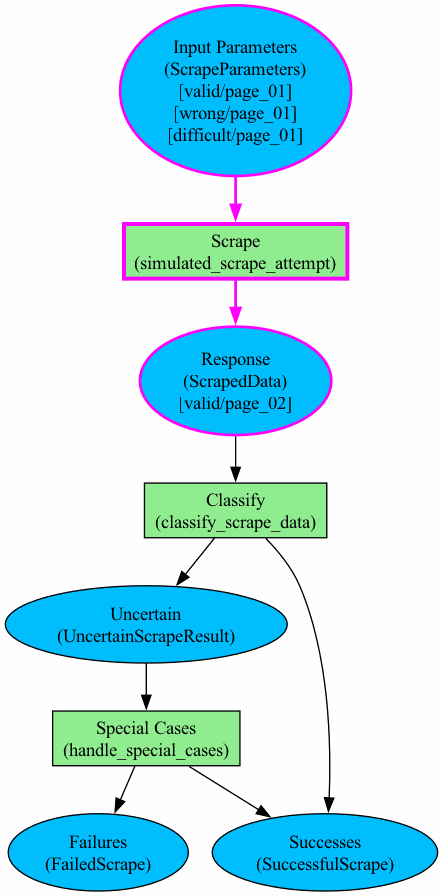

# Petritype

Typed, executable, visual Petri nets in Python.

Petritype turns [Petri nets](https://en.wikipedia.org/wiki/Petri_net) into a practical tool for building and visualising data processing pipelines. Places are typed containers, transitions are real Python functions, and tokens are your actual data — Pydantic models, dataclasses, primitives, whatever you need. Types are enforced at runtime, so wiring errors surface immediately rather than silently propagating.

*Early stage — contributions and feedback welcome.*

<p align="center"></p>

## Core Idea

A Petri net has two kinds of nodes connected by directed edges:

- **Places** (blue ovals) — typed containers that hold tokens
- **Transitions** (green rectangles) — functions that consume tokens from input places and produce tokens into output places

A transition can only fire when all of its input places have tokens available. When it fires, it pops tokens from input places, calls its function, and routes the result to output places based on type matching. The current set of tokens across all places represents the live state of the system.

Petritype adds a type system on top of this: each place declares the Python type it accepts, and every token is checked against that type. This means the graph itself encodes the shape of your data pipeline — what types flow where, what each function expects, and where different outcomes end up.

## Quickstart

```python
import asyncio
from petritype.core.executable_graph_components import (
    ExecutableGraphOperations,
    FunctionTransitionNode,
    ListPlaceNode,
    ArgumentEdgeToTransition,
    ReturnedEdgeFromTransition,
)

# 1. Define your types and functions
def double(x: int) -> int:
    return x * 2

# 2. Build the graph
graph = ExecutableGraphOperations.construct_graph([
    ListPlaceNode('Input', int, [1, 2, 3]),
    ArgumentEdgeToTransition('Input', 'Double', 'x'),
    FunctionTransitionNode('Double', double),
    ReturnedEdgeFromTransition('Double', 'Output'),
    ListPlaceNode('Output', int),
])

# 3. Execute
graph, fired = asyncio.run(
    ExecutableGraphOperations.execute_graph(graph, stop_after_n_firings=3)
)

print(graph.place_named('Output').tokens)  # [6, 4, 2]
```

`construct_graph` takes a flat list of places, transitions, and edges in any order — it sorts them out. Execution runs an async loop: find enabled transitions, select one, fire it, repeat.

## Key Features

### Runtime type checking

Places declare types. Tokens are validated on entry. If a transition returns a `str` but the output place expects `int`, you get an immediate error — not a silent downstream failure.

```python
ListPlaceNode('Scores', float, [0.95, 0.87])   # only accepts float tokens
ListPlaceNode('Labels', str, ['cat', 'dog'])     # only accepts str tokens
```

Type matching also governs output routing: when a transition has multiple output places, the result is sent to the place whose type matches.

### Static structure checks

For pipeline-shaped nets you can prove termination before running anything: `construct_graph(..., expect_acyclic=True)` (or `ExecutableGraphCheck.assert_acyclic(graph)`) rejects token cycles at build time, naming the offending path (`P1 → T1 → P2 → T2 → P1`). Acyclicity alone is not termination — a *source* transition that consumes no tokens fires forever in a perfectly acyclic net — so pair it with `ExecutableGraphCheck.assert_no_source_transitions(graph)`; a net that passes both provably quiesces. Nets that are cyclic or source-fed on purpose get run-time bounds instead (`error_after_n_firings`).

### Failure semantics

If a transition body raises, the firing fails with `TransitionFailedError`. The tokens it consumed are **not** put back: the body may have mutated them before failing, and a place should never silently hold corrupted tokens — a visible loss beats invisible corruption. The consumed tokens ride along on the error:

```python
try:
    await ExecutableGraphOperations.execute_graph(graph)
except TransitionFailedError as e:
    e.transition_name   # 'Charge Card'
    e.consumed          # {'order': <the consumed token>}
    e.__cause__         # the original exception
```

*Expected* failures are the body's job: catch them and return an error token, and type-based routing (e.g. `-> Receipt | FailedOrder`) delivers it to an error-handling place. If your tokens are immutable or bodies don't mutate them before failing, `restore_tokens_on_failure=True` (on `construct_graph` or per `execute_graph` call) opts into putting consumed tokens back.

### Async execution

Transition functions can be `async`. The execution loop handles both sync and async functions transparently.

```python
async def fetch(url: str) -> str:
    async with aiohttp.ClientSession() as session:
        async with session.get(url) as resp:
            return await resp.text()

FunctionTransitionNode('Fetch', fetch)
```

### Guards, priorities, and transition selectors

Each transition can carry two optional callables. Both receive the live graph, so they can read the whole marking:

- **`guard`** — an enabling condition the engine enforces in every execution mode: a transition whose guard returns `False` is not enabled, regardless of available tokens. Guards run on every enabled-discovery sweep, so keep them cheap, side-effect-free predicates over the marking.
- **`priority`** — a selection hint: the default selector fires the highest-priority enabled transition. Unset scores `0.0`; ties fall back to definition order.

```python
# Guard: BatchProcess is not enabled until the pool is full
def batch_ready(graph) -> bool:
    return len(graph.place_named('Pool').tokens) >= 10

# Priority: drain the longest queue first
def queue_pressure(graph) -> float:
    return len(graph.place_named('Queue').tokens)

FunctionTransitionNode('BatchProcess', batch_process, guard=batch_ready)
FunctionTransitionNode('Drain', drain, priority=queue_pressure)
```

For full control over what fires next, replace the selector itself — a function from the enabled transitions to the one to fire:

```python
graph.transition_selector = my_selector   # (graph, enabled) -> transition or None
```

The older `activation_function` field is deprecated: the engine never consulted it, so use `guard` or `priority` instead. It remains visible to custom selectors until removed.

See [dev-docs/TRANSITION_SELECTION.md](dev-docs/TRANSITION_SELECTION.md) for round-robin, bottleneck-aware, and other selector patterns.

### Visualisation

Built-in Graphviz rendering shows the graph structure, types, and current token state — including read arcs (dashed) and, in concurrent runs, in-flight transitions highlighted while their bodies run. The example notebooks (marimo) step through and animate execution live.

```python
from petritype.plotting.simple_graphviz import SimpleGraphvizVisualization

# Static graph image
SimpleGraphvizVisualization.graph(graph)

# Step-by-step animation in Jupyter
async for step in SimpleGraphvizVisualization.animate_execution_generator(graph):
    display(step)
```

### Output distribution

When a transition has multiple output places, tokens are routed by type matching. For custom routing logic, provide an output distribution function:

```python
def route_result(result) -> dict[str, Any]:
    if result.score > 0.9:
        return {'Approved': result}
    else:
        return {'NeedsReview': result}

FunctionTransitionNode(
    'Classify', classify,
    output_distribution_function=route_result,
)
```

### Token copying

When a transition produces a token that matches multiple output places by type, Petritype raises an error by default — this prevents accidental duplication. If you want the same token to be sent to multiple output places (via `deepcopy`), enable token copying when constructing the graph:

```python
graph = ExecutableGraphOperations.construct_graph([...], allow_token_copying=True)
```

This is useful when the same piece of data needs to flow down multiple independent paths — for example, a configuration token consumed by both a planning stage and a data-fetching stage.

### List-mode transitions

If a transition argument is typed as `list[T]` and the input place holds tokens of type `T`, all tokens are passed as a list in a single call — useful for batch operations.

```python
def summarise(items: list[str]) -> str:
    return f"Processed {len(items)} items"

# All str tokens from 'Items' are passed at once
ArgumentEdgeToTransition('Items', 'Summarise', 'items')
```

### Read arcs — non-consuming reads

A transition can *read* a place without consuming its tokens — useful for parameters, toggles, or guard state, kept as visible, pokable nodes. Both require a token to be present to enable the transition, but firing never consumes it:

- **`SnapshotEdge`** — the transition receives a deep-copy; the place is untouched.
- **`MutateEdge`** — the transition receives the live tokens and may modify them in place.

```python
from petritype.core.executable_graph_components import SnapshotEdge, MutateEdge

SnapshotEdge('Multiplier', 'Scale', 'factor')   # Scale reads Multiplier, never consumes it
MutateEdge('Counter', 'Scale', 'tally')          # Scale increments Counter in place
```

Read arcs render dashed, distinct from the solid consuming / producing arrows.

### Decorator for registration

Mark functions as Petri net factories with execution mode metadata, useful for discovery and orchestration tooling.

```python
from petritype import petri_net

@petri_net(name="data-pipeline", mode="batch")
def data_pipeline() -> ExecutableGraph:
    return ExecutableGraphOperations.construct_graph([...])

@petri_net(name="health-check", mode="cron", schedule="*/5 * * * *")
def health_check() -> ExecutableGraph:
    return ExecutableGraphOperations.construct_graph([...])
```

Modes: `manual` (default), `24/7` (continuous), `batch` (run once), `cron` (scheduled).

## Runtime — observable, interactive nets

Beyond running a net to completion, `petritype.runtime` turns a net into a **live object you can watch and poke while it runs** — for monitoring, real-time simulations, or interactive tools. The graph is the single source of truth; a `Runner` (a set of functions, no objects to construct) drives it via a passive `RunContext` the caller owns.

```python
from petritype.runtime import Runner, RunContext, ExecutionMode, Extend

ctx = RunContext(graph=graph, mode=ExecutionMode.CONCURRENT, observers=(render,))
await Runner.run_to_completion(ctx)   # or Runner.step(ctx) / Runner.run_indefinitely(ctx, tick=0.1)
```

- **One definition, two execution modes** — `SEQUENTIAL` fires one transition fully before the next; `CONCURRENT` runs independent transitions' bodies as overlapping tasks (wall-clock ≈ max instead of sum). Selected by `RunContext.mode` — the only line that changes.
- **Observation** — `observers` are plain callables handed the *live graph* after each state change, so any renderer (a marimo notebook, a web frontend) can redraw at its own pace. In-flight transitions are exposed via `graph.in_flight`, so a renderer could for example highlight them by changing their colour while their bodies run. To know *what fired since you last looked*, snapshot `graph.fired_counts` and diff it at the next notification with `fired_since(previous, current)` — lossless in every mode, unlike `graph.last_fired`, which names only one completion per concurrent batch.
- **Interactive input** — write to a running net by putting typed commands on `RunContext.inbox`, drained between steps: `Extend` / `SetTokens` (places), `SetParam` / `Enable` / `Disable` (transitions). A UI only ever *produces commands* — the runner is the only thing that mutates the net.
- **Real-time** — `run_indefinitely(ctx, tick=...)` drives the net on an internal clock until `ctx.stop`, surviving idle ticks, so you can inject input live.
- **Limits** — `Runner.run(ctx, stop_after_n_firings=N)` paces: it always returns a `RunSummary` whose `quiesced` flag tells "stopped by the limit, call again to continue" from "nothing left to fire". `RunContext.error_after_n_firings` is a run-wide fuse for nets that should quiesce quickly: `TooManyFiringsError` is raised *before* the net fires past it (a net that fires exactly n and quiesces is fine).
- **Offload** — mark a blocking / CPU-bound body `FunctionTransitionNode(..., execution="thread")` and it runs in a thread pool, so it never freezes the loop (and parallelises in concurrent mode).
- **Control-map** — bind UI widgets to nodes declaratively with `{name: ControlSpec}`, kept off the net; `petritype.marimo_controls` renders them and feeds their values to the inbox.

Runnable examples: `examples/execution_modes/` (sequential vs concurrent, animated) and `examples/interactive/` (live parcel sorters, a read-arc scaler) — open with `uv run --extra examples marimo edit <notebook>`.

## When to Use This

Petritype is useful when you have stateful data processing where:

1. **Data flows through multiple stages with different representations** — the typed places make the shape of each stage explicit.
2. **Outcomes are not easily predictable** — different result types route to different places, making branching logic visible in the graph rather than hidden in conditionals.
3. **You need to reason about complex processes** — the graph is both the implementation and the documentation.

It has been particularly useful for processes involving many calls to stateful external data sources, where the data flow paths depend on responses and not all paths can be known in advance.

## When Not to Use This

1. **Simple pipelines** — if your processing is a straightforward chain of pure functions, the Petri net overhead adds complexity without benefit.
2. **Order-sensitive processing with shared state** — each transition firing mutates the graph in place. If the order matters and is hard to control, this can be a source of bugs.
3. **Complex net dynamics** — cycles, deadlocks, and infinite loops are all possible in Petri nets and can be difficult to debug. Use the formalism with care.

## Background: What is a Petri Net?

A [Petri net](https://en.wikipedia.org/wiki/Petri_net) is a bipartite directed graph used to model concurrent processes. It was originally developed by Carl Adam Petri in 1962 and has been applied across chemistry, logistics, manufacturing, protocol verification, and many other fields.

The graph has two types of nodes — **places** and **transitions** — connected by directed edges (arcs). Places hold **tokens** representing the state of the system. A transition is enabled when all its input places contain at least one token. When a transition fires, it removes tokens from its inputs and adds tokens to its outputs.

What makes Petri nets powerful is that they can model concurrency, synchronisation, and resource contention in a way that is both formally analysable and visually intuitive.

Petritype builds on this foundation by making places typed (so tokens must match a declared Python type) and making transitions executable (so they call real functions). The result is a system where the Petri net is not just a model of your process — it *is* your process.

<!-- ## Installation


```bash
pip install petritype
``` 

Install with uv

-->

Requires Python 3.14+.

<!-- ## Examples

See the [`examples/`](examples/) directory:

- **Caching** — database retrieval with cache fallback, demonstrating typed routing for cache hits vs misses
- **ML Training** — multi-step model training pipeline with evaluation and retraining loops
- **Time Series** — statistical processing of time series data -->
